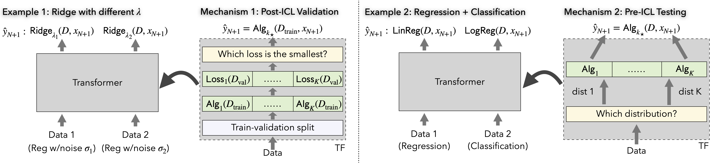

# Transformers as Statisticians
This repository provides the official implementation for the paper:

**Transformers as Statisticians: Provable In-Context Learning with In-Context Algorithm Selection**.  
Yu Bai, Fan Chen, Huan Wang, Caiming Xiong, Song Mei.  
Paper: https://arxiv.org/abs/2306.04637.



## Getting started

### Create conda environment
```
conda env create -f environment.yml
```

### Training
Train the encoder model on all tasks (enter `src/` first):
```
chmod +x ./train_encoder_all.sh
./train_encoder_all.sh
```
Run `train_lasso.sh` for the specific task of sparse linear regression (which uses a different optimization method from the tasks in the above script). Run `train_gpt_all.sh` for training the decoder (gpt-like) model. 

Check out the corresponding config files in `conf/` for the detailed training configurations. To set up a training run with a customized config file, run `python train.py --config conf/$myconf.yaml$`, where `$myconf.yaml$` is the customized config file.

### Tracking training with wandb
populate `conf/wandb.yaml` with you wandb info.

### Evaluation and plotting
See `encoder_plotting.ipynb` and `gpt_plotting.ipynb` for details.

### Test runs
Add `test_run: True` into the conf to start a test run, which trains for a small number of steps with saving & wandb disabled.

## Miscellanous
The code is built upon https://github.com/dtsip/in-context-learning.  
More information about the code can also be found in the above repo.

If you use this code in your research, please cite our paper
```
@article{bai2023transformers,
  title={Transformers as Statisticians: Provable In-Context Learning with In-Context Algorithm Selection},
  author={Bai, Yu and Chen, Fan and Wang, Huan and Xiong, Caiming and Mei, Song},
  journal={arXiv preprint arXiv:2306.04637},
  year={2023}
}
```
